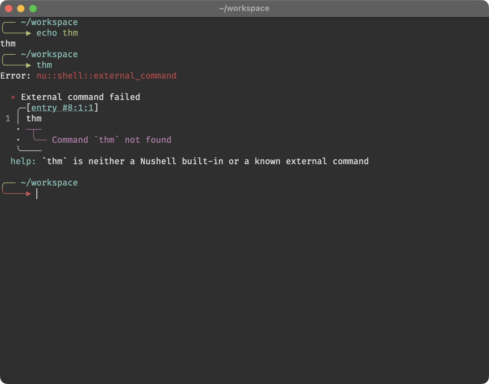

# thm theme

Another yet theme for Oh-My-Zsh and Starship<br>
A modified 'The Poncho' theme

## Installation guide

### Oh-My-Zsh

```bash
wget -P ~/.oh-my-zsh/themes https://raw.githubusercontent.com/thm-unix/thm-zshtheme/main/thm.zsh-theme
```

- Set ZSH_THEME="thm" in ~/.zshrc<br>

### Starship

```bash
wget -P ~/.config https://raw.githubusercontent.com/thm-unix/thm-zshtheme/main/starship.toml
```

## Screenshot



