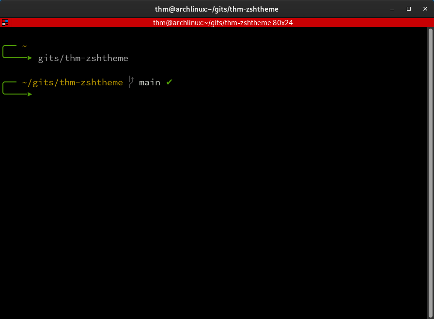

# thm-zshtheme
Another yet theme for Oh-My-Zsh<br>
A modified 'The Poncho' theme

## Installation guide
1) ```git clone https://github.com/thm-unix/thm-zshtheme; cd thm-zshtheme```<br>
2) Copy thm.zsh-theme into ~/.oh-my-zsh/themes<br>
3) Set ZSH_THEME="thm" in ~/.zshrc<br>

## Screenshot

